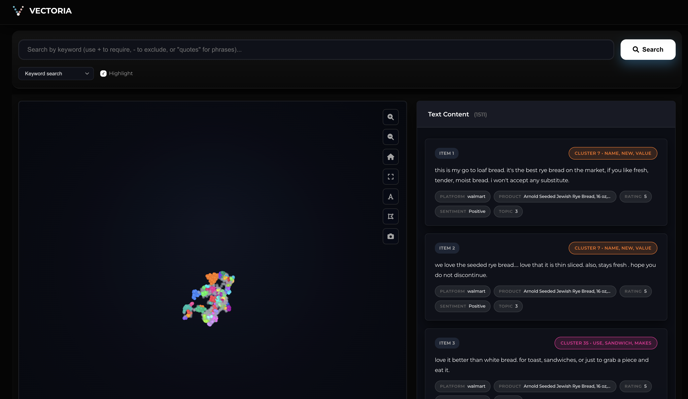

<p align="center">
  
</p>

<p align="center">
  <strong>Browser-first text exploration, clustering, and semantic search</strong>
</p>

<p align="center">
  <a href="https://vectoria.vercel.app">
    
  </a>
</p>

<p align="center">
  <a href="https://opensource.org/licenses/MIT">
    
  </a>
</p>

A fully browser-native semantic search, exploration, and RAG system that runs 100% client-side.

🚀 **Built on Open-source** | 🔒 **Privacy-preserving** | 📊 **Interactive Visualization** | 🤖 **AI-powered RAG** | ⚡ **Offline-capable**

<p align="center">
  
</p>

---

## What is Vectoria?

Vectoria is a tool for **browser-first text exploration, clustering, and semantic search** that combines:
- **Document embedding** and semantic search
- **Interactive 2D visualization & exploration** via UMAP clustering
- **RAG (Retrieval-Augmented Generation)** for intelligent Q&A
- **Hybrid search** (vector + keyword)

All running **entirely in your browser using your device's hardware** with zero backend infrastructure.

## Potential use cases

- **Personal knowledge bases** - Organize notes, papers, documents.
- **Research data exploration** - Explore corpora and qualitative data.
- **Corporate document analysis** - Privacy-preserving semantic search.
- **Educational tools** - Learn about embeddings, RAG, and clustering.
- **Multilingual content** - Analyze text in multiple languages.

### Key features

- **Multi-format support** - CSV, Excel, JSON, TXT
- **Multilingual embeddings** - Multilingual-e5-small (100+ languages)
- **Browser-based LLM** - Multiple models (Gemma 2, Llama 3.2, Qwen 3, etc.) for RAG via WebGPU
- **UMAP visualization** - Interactive 2D semantic maps
- **Hybrid search** - Vector similarity + BM25 keyword matching
- **Persistent storage** - IndexedDB caching for instant reload
- **Privacy-first** - All data processing happens on your device

---

> [!WARNING]
> **System requirements & first load**
>
> * **Storage:** The first load will download AI models and requires **at least 5GB** of free disk space.
> * **Hardware:** A device with a dedicated GPU or modern integrated graphics (Apple Silicon M1/M2/M3) is strongly recommended.
>
> **Browser requirements:**
> * **Chrome/Edge 120+** (WebGPU support required)
> * **8GB+ RAM** (16GB recommended for large datasets)
> * **Stable internet** (first load only - cached thereafter)

---

## How to use

### 1. Upload your data
Drag & drop or select:
- CSV files (with header row)
- Excel spreadsheets (.xlsx, .xls)
- JSON files (array of objects)
- Plain text files (.txt)

### 2. Process & visualize
1. Select the text column to analyze.
2. Click "Process Data".
3. **Watch progress:** Parsing → Embedding → UMAP dimensionality reduction → HDBSCAN clustering → Done.
4. The interactive 2D visualization will appear automatically - ready for exploration and search.

### 3. Search & explore

**Fast search**
- Type a query: `"machine learning applications"`
- Get instant results with text highlighting. Supports keywords and Boolean logic.

**Semantic search**
- Type a conceptual query.
- Get results that are semantically similar to your query, even if they don't share keywords.

**RAG query (AI-powered)**
- Switch to "Semantic Search (RAG)".
- Ask: `"What are the main topics discussed?"`
- The local AI generates an answer with source citations.

---

## Project structure

```
vectoria/
├── web_interface/              # Main application
│   ├── index.html             # Entry point
│   ├── static/
│   │   ├── css/               # Styling
│   │   └── js/
│   │       ├── browser-ml/    # Core ML modules
│   │       │   ├── chunking/          # Document chunking (Chonkie.js)
│   │       │   ├── embedding/         # Embedding utilities
│   │       │   ├── umap-wasm/         # UMAP WebAssembly
│   │       │   ├── embeddings.js
│   │       │   ├── embedding-worker.js
│   │       │   ├── vector-search.js
│   │       │   ├── llm-rag.js
│   │       │   ├── llm-worker.js
│   │       │   ├── file-processor.js
│   │       │   ├── clustering.js
│   │       │   ├── hdbscan-pyodide.js
│   │       │   ├── pyodide-hdbscan-worker.js
│   │       │   ├── umap-wasm-adapter.js
│   │       │   ├── storage.js
│   │       │   ├── export.js
│   │       │   └── index.js
│   │       ├── browser-integration.js
│   │       ├── browser-capabilities.js
│   │       ├── config-manager.js
│   │       ├── export-import.js
│   │       ├── fast-search.js
│   │       ├── hyde-handler.js
│   │       ├── main.js
│   │       ├── model-constraints.js
│   │       ├── search-enhancement.js
│   │       ├── vectoria.js
│   │       ├── viz.js
│   │       └── webgl-renderer.js
│   └── sw.js                  # Service worker
├── package.json
└── vercel.json
```

### Browser ML modules

| Module | Purpose | Technology |
|--------|---------|------------|
| `embeddings.js` | Text → vectors | @huggingface/transformers (ONNX) |
| `vector-search.js` | Similarity + keyword search | JS HNSW + BM25 |
| `llm-rag.js` | RAG Q&A | WebLLM (multi-model) |
| `file-processor.js` | Parse CSV/Excel/JSON/TXT | PapaParse, SheetJS |
| `clustering.js` | UMAP + HDBSCAN clustering | UMAP-WASM, Pyodide |
| `storage.js` | Persistent caching | localforage (IndexedDB) |
| `chunking/` | Document chunking for RAG | Chonkie.js |
| `index.js` | Pipeline orchestration | Coordinates all modules |

---

## Tech stack

### Browser ML
- **Embeddings**: @huggingface/transformers + `multilingual-e5-small` (384D, 100+ languages)
- **LLM**: WebLLM with multi-model support (Gemma 2, Llama 3.2, Qwen 3, DeepSeek R1, SmolLM2, Phi 3.5)
- **Vector search**: Pure JavaScript HNSW implementation
- **Keyword search**: BM25 (TF-IDF ranking)
- **Dimensionality reduction**: UMAP-WASM (WebAssembly accelerated)
- **Clustering**: HDBSCAN via Pyodide (scikit-learn in browser)
- **Document chunking**: Chonkie.js
- **Storage**: IndexedDB via localforage

### Frontend
- **UI**: Vanilla JavaScript
- **Visualization**: WebGL (hardware-accelerated)
- **Styling**: Custom CSS with glassmorphism
- **Icons**: Font Awesome

### Infrastructure
- **Hosting**: Vercel (edge network)
- **Models**: Loaded from HuggingFace CDN

---

## Privacy & security

**All processing happens in your browser and on your device.**
- No data uploaded to servers.
- No tracking or analytics.
- No cookies (except localStorage/IndexedDB for caching).

**Clear data anytime**
- Use the "Delete Data & Cache" button in the app to remove indexed data and cached AI models.
- Or clear via your browser's "Clear Browsing Data" settings.

---

## Troubleshooting

> **Note:** Processing speed and analysis capabilities are entirely dependent on your device's power.

### Models won't load
Enable WebGPU in your browser:
1. Go to `chrome://flags`
2. Search "WebGPU"
3. Set to **Enabled**

### Out of Memory
- Use a smaller dataset (<10K docs).
- Close other resource-heavy tabs.
- Use a desktop browser (mobile browsers allocate less memory).

### Slow Performance
- Ensure Hardware Acceleration is enabled in browser settings.
- Reduce the number of UMAP neighbors in settings.

---

## Acknowledgments

**Technologies**:
- [@huggingface/transformers](https://huggingface.co/docs/transformers.js) by Hugging Face
- [WebLLM](https://github.com/mlc-ai/web-llm) by MLC AI
- [UMAP](https://apple.github.io/embedding-atlas/algorithms.html#umap) WebAssembly implementation by Apple
- [localforage](https://github.com/localForage/localForage) by Mozilla
- [Chonkie](https://github.com/chonkie-inc/chonkiejs) for document chunking
- [Pyodide](https://pyodide.org/en/stable/) for Python distribution in the browser

Thank you for making this possible.

---

## What makes this special

1.  **Zero Infrastructure & Zero Cost** - No servers, no databases, no backend.
2.  **Privacy-First** - Data never leaves the user's device.
3.  **Offline-Capable** - Works without an internet connection after initial load.
4.  **Production-Ready** - Complete, tested, and documented.

This proves that sophisticated AI applications can run entirely in the browser.

---

## Contributing

Contributions are incredibly welcome! Whether you're fixing a bug, improving the docs, or adding a new feature, every bit helps.

Feel free to:
- **Fork** the repository and experiment.
- **Submit Pull Requests** for bug fixes or new features.
- **Report Issues** if you find bugs or have ideas.

**Support the project:**
If you find Vectoria interesting or useful, **please give it a star ⭐**! It helps more people discover the project.

---

**Vectoria** - Semantic exploration without limits.

MIT License - Free for personal and commercial use.
